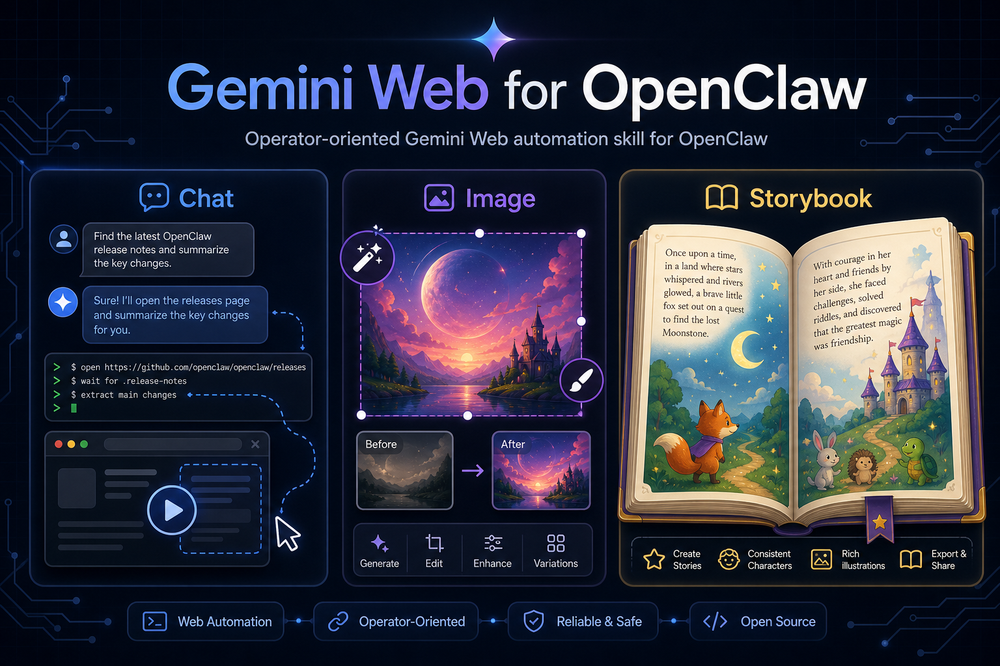
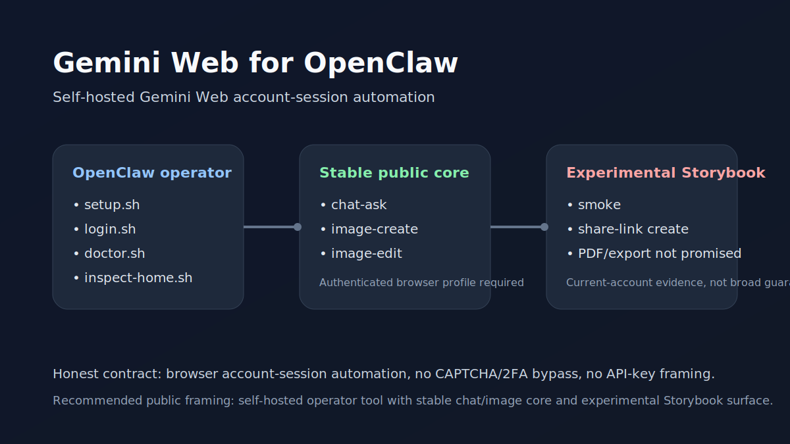
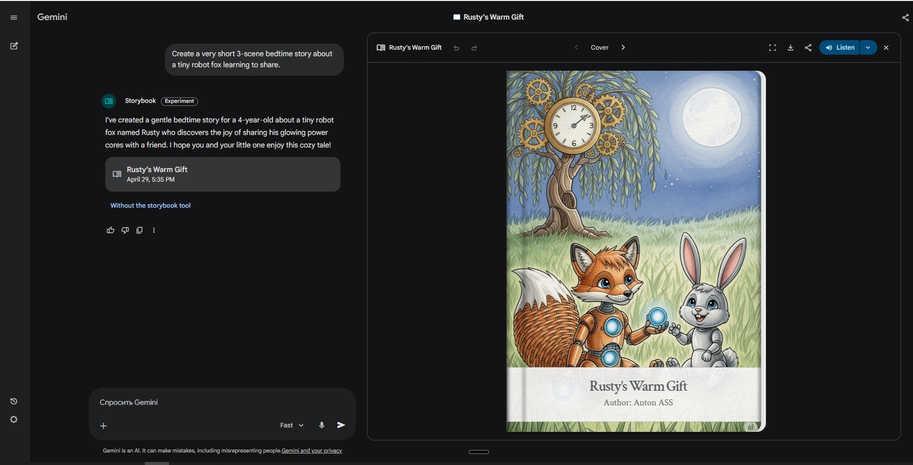
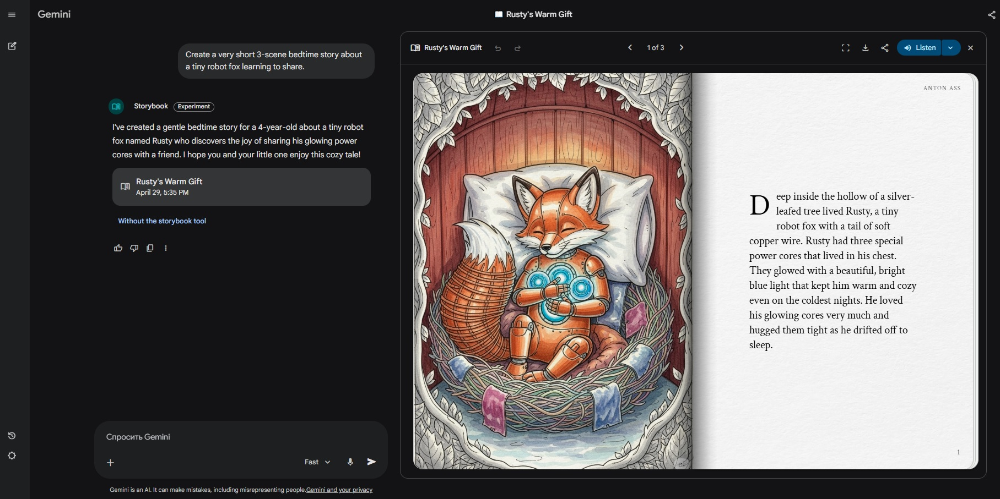

# Gemini Web for OpenClaw



Self-hosted Gemini Web account-session automation for OpenClaw.

This repo drives the **real Gemini Web UI** through Playwright and a persistent browser profile. It is built for **operator-side browser automation**, not Gemini API-key integration.



## What this repo is

Use it when you want OpenClaw to work with a real logged-in Gemini Web account for:

- normal Gemini chat flows
- Gemini Web image creation
- Gemini Web image editing
- selective Storybook/Gems workflows that only exist in the web surface

## Stable public core

These are the surfaces this repo can honestly promise today:

- `chat-ask`
- `chat-ask-stream` (real-time streaming text output)
- `image-create`
- `image-edit`
- `document-analysis` (upload files and query them)

## Experimental surfaces

These exist, but are **not** part of the stable public promise:

- Storybook `smoke`
- Storybook `create --return-mode share_link`
- Storybook PDF export
- Storybook file upload
- long-term selector stability across arbitrary Gemini accounts or regions

Storybook has **current-account live validation evidence**, but it remains **experimental and account-dependent**.

## Important auth reality

This project uses a **real Gemini browser session** on the actual runtime host.

That means:

- **local install** is the easiest and recommended path
- **remote install** can work, but login happens on the remote host browser profile
- this repo does **not** bypass CAPTCHA, 2FA, device verification, or Google security checks
- this repo does **not** use Gemini API keys as its main integration model

## Who this is for

- OpenClaw operators
- self-hosted setups where one-time interactive login is acceptable
- people who specifically need Gemini Web account-session automation rather than API access

## Who this is not for

- zero-config consumer SaaS onboarding
- users who do not want Google login on the runtime host
- headless-only VPS setups with no honest browser-login path
- people expecting Storybook to be a fully stable public surface today

## Quick start

### Local Desktop Install
```bash
cd ~/.openclaw/workspace/skills
git clone https://github.com/AntonioIRK/gemini-web-openclaw-skill.git gemini-web
cd gemini-web
./scripts/setup.sh
./scripts/gemini_web_login.sh
./scripts/gemini_web_doctor.sh
./scripts/gemini_web_inspect_home.sh
```

### Docker Install (Headless VNC Auth)
If you are running on a remote headless server, you can use the provided Docker environment. It runs Playwright via Xvfb and exposes a noVNC server on port `6080` for the initial Google login:
```bash
docker compose up -d
docker compose exec gemini-web ./scripts/gemini_web_login.sh
```
See [Docker Guide](docs/docker.md) for more details.

## Example commands

```bash
# Ask Gemini in the current reused thread
./scripts/gemini_web.sh chat-ask --prompt "Summarize this topic in 3 bullets"

# Create an image
./scripts/gemini_web_image_create.sh --prompt "A friendly robot watering a tiny garden"

# Edit an image
./scripts/gemini_web_image_edit.sh --file ./scene.jpg --prompt "Add a realistic UFO in the sky"
```

## Example output

Pages from a recent generated Storybook run:





## Readiness model

Use these states distinctly:

- **Installed** — setup, dependencies, and wrappers are present.
- **Authenticated** — the persistent Gemini profile is really logged in on the runtime host.
- **Operator-validated** — a human or agent has run live Gemini checks on that authenticated host.
- **Stable public core** — the part of the repo we are comfortable promising broadly today.

Storybook currently belongs to **operator-validated evidence**, not to the **stable public core**.

## What is validated today

- persistent browser profile bootstrap
- doctor command for environment/session heuristics
- inspect-home command for Gemini surface visibility
- chat flow with thread reuse and text streaming
- image-create flow
- image-edit flow
- document-analysis file upload flow
- diagnostics capture on failures
- repeated live Storybook share-link success on the current authenticated operator account

## Safety posture

- no CAPTCHA or 2FA bypass
- no cookie scraping or hidden credential import
- CDP attach remains explicit opt-in only
- diagnostics should be treated as private
- this repo is designed for user-approved persistent profile reuse, not silent account takeover

## Documentation

Public-first docs:

- [Install guide](docs/install.md)
- [Authentication guide](docs/auth.md)
- [Validation guide](docs/validation.md)
- [Privacy and diagnostics](docs/privacy.md)
- [Storybook status](docs/storybook-status.md)

Reference docs:

- `references/prerequisites.md`
- `references/support-matrix.md`
- `references/remote-install-and-auth.md`
- `references/release-evidence.md`
- `references/public-release-status.md`

Maintainer-only notes live under `references/internal/` and are not part of the public stability contract.

## Project layout

- `SKILL.md` — OpenClaw skill entry and operational behavior
- `scripts/` — operator-facing wrappers
- `src/` — Python runtime
- `docs/` — public-first documentation
- `references/` — deeper supporting notes and release evidence

## Release contract

If this repo is made public in its current shape, the honest contract is:

- it is an **operator-oriented self-hosted tool**
- it expects a **real Gemini Web browser session** on the runtime host
- the **stable public core** is `chat-ask`, `image-create`, and `image-edit`
- Storybook remains **experimental and account-dependent**

## Current limitations

- Storybook is still outside the stability promise
- Google-side runtime failures can still happen even when the local automation path is correct
- diagnostics may contain account-adjacent data and should be reviewed before sharing
- users of higher-level agent wrappers should constrain file-upload and output-path behavior carefully

## Development snapshot

Current package version: `0.1.0`

For the detailed evidence behind the current release framing, see:

- `references/release-evidence.md`
- `references/public-release-status.md`

## License

MIT
